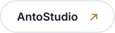
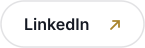

<a href="https://rubenschnettler.cl">
  <picture>
    <source media="(prefers-color-scheme: dark)" srcset="assets/header-dark.svg">
    
  </picture>
</a>

 
 

  <a href="https://rubenschnettler.cl"><picture><source media="(prefers-color-scheme: dark)" srcset="assets/btn-portfolio-dark.svg"></picture></a>&nbsp;
  <a href="https://antostudio.cl"><picture><source media="(prefers-color-scheme: dark)" srcset="assets/btn-antostudio-dark.svg"></picture></a>&nbsp;
  <a href="https://blog.rubenschnettler.cl"><picture><source media="(prefers-color-scheme: dark)" srcset="assets/btn-blog-dark.svg"></picture></a>&nbsp;
  <a href="https://www.linkedin.com/in/rubensch/"><picture><source media="(prefers-color-scheme: dark)" srcset="assets/btn-linkedin-dark.svg"></picture></a>&nbsp;
  <a href="mailto:rubenschnettlerl@gmail.com"><picture><source media="(prefers-color-scheme: dark)" srcset="assets/btn-email-dark.svg"></picture></a>

 

Me gusta entender cómo funcionan las cosas —y las organizaciones— para después hacerlas funcionar mejor.

Soy ingeniero civil industrial y MBA, pero mi camino no fue en línea recta: partí en la acuicultura, pasé por la gestión universitaria y los programas STEM, y hoy vivo entre **el código, los datos y la sala de clases**. Cada etapa me dejó algo: el rigor del laboratorio, la mirada de gestión y la paciencia de quien explica la misma idea de cinco maneras distintas hasta que hace clic.

 

## 🎓 La sala de clases

Enseñar es lo que más disfruto de mi trabajo. Hago clases de **programación, gestión y matemáticas** en la universidad, y antes pasé por **Enseña Chile**, donde aprendí que una buena clase puede cambiar una trayectoria completa.

He coordinado programas STEM con **más de 1.500 estudiantes** y rediseñé el currículo por competencias de **seis carreras de ingeniería**. Pero lo que más me importa sigue siendo lo mismo: que alguien entienda algo que ayer no entendía.

> **Si eres mi estudiante:** te doy la bienvenida. Todo lo que ves en este perfil empezó justo donde estás tú ahora: con un error en la consola y ganas de entender por qué. Pregunta sin miedo, equivócate rápido y comparte lo que aprendas. Ese es el oficio.

 

## 🛠️ Construir con propósito

En **[AntoStudio](https://antostudio.cl)** acompaño a empresas, emprendedores e instituciones desde la primera conversación hasta el despliegue. Antes de escribir código miro cómo trabaja el equipo hoy: las planillas, los correos, los pasos que se repiten cada semana. Recién ahí decidimos qué conviene automatizar, qué conviene ordenar y qué es mejor dejar tranquilo.

- **Software a medida** · paneles internos, portales y flujos de aprobación con Django y React.
- **Datos e IA con criterio** · reportes que se generan solos, tableros claros y modelos que responden una pregunta concreta del negocio.
- **Procesos antes que pantallas** · ordenar la casa, definir buenos indicadores y recién después automatizar.

**Algunos proyectos recientes**

- **OC Express** — órdenes de compra y documentos PDF listos para enviar en segundos. `Next.js` `React`
- **AntoDreams** — plataforma de bienestar con una experiencia cuidada y un backend sólido. `Nuxt` `Django` `PostgreSQL`
- **[Blog + CMS headless](https://blog.rubenschnettler.cl)** — donde escribo sobre gestión, tecnología e IA. `Django REST` `Next.js` `Markdown`
- **RetroAnto** — e-commerce de ropa vintage, del catálogo al despacho. `React` `Django` `PostgreSQL`

 

## ⚡ Stack activo

  
  
  
  
  
  
  
  
  
  
  
  
  
  
  

 

## 🌊 Fuera del código

- **Papá de Antonia**, mi proyecto favorito y el más desafiante de todos.
- Vivo en **Viña del Mar**: pocas cosas ordenan tanto las ideas como una caminata frente al mar.
- Creo en el **aprendizaje continuo**: todavía me emociona aprender algo nuevo y contarlo en clases al día siguiente.

 

## 🐍 Un año en commits

<picture>
  <source media="(prefers-color-scheme: dark)" srcset="https://raw.githubusercontent.com/Chacarerin/chacarerin/output/snake-dark.svg">
  
</picture>

 
 

<picture>
  <source media="(prefers-color-scheme: dark)" srcset="assets/quotes-dark.svg">
  
</picture>
