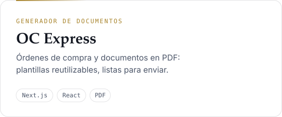
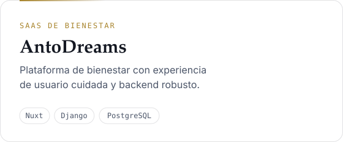
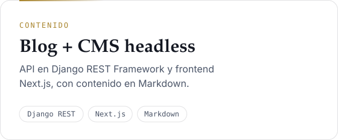
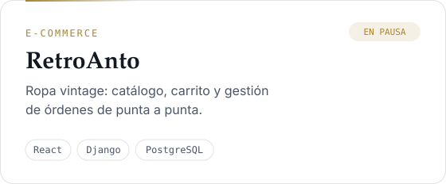

<a href="https://rubenschnettler.cl">
  <picture>
    <source media="(prefers-color-scheme: dark)" srcset="assets/header-dark.svg">
    
  </picture>
</a>

  
  
  
  
  

 

Ingeniero civil industrial y MBA. Trabajo donde se cruzan **la gestión, los datos y el software**: acompaño a equipos que quieren profesionalizar procesos, adoptar IA y construir productos digitales que funcionen en el tiempo.

Mi método es simple: **primero entender, después construir.** Escuchar bien, mirar los datos con atención y recién ahí escribir código.

 

## Lo que construyo

<table>
  <tr>
    <td width="50%">
      <a href="https://antostudio.cl"><picture>
        <source media="(prefers-color-scheme: dark)" srcset="assets/card-oc-express-dark.svg">
        
      </picture></a>
    </td>
    <td width="50%">
      <a href="https://antostudio.cl"><picture>
        <source media="(prefers-color-scheme: dark)" srcset="assets/card-antodreams-dark.svg">
        
      </picture></a>
    </td>
  </tr>
  <tr>
    <td width="50%">
      <a href="https://blog.rubenschnettler.cl"><picture>
        <source media="(prefers-color-scheme: dark)" srcset="assets/card-blog-dark.svg">
        
      </picture></a>
    </td>
    <td width="50%">
      <a href="https://antostudio.cl"><picture>
        <source media="(prefers-color-scheme: dark)" srcset="assets/card-retroanto-dark.svg">
        
      </picture></a>
    </td>
  </tr>
</table>

Estos productos los desarrollo en **[AntoStudio](https://antostudio.cl)**, mi estudio de desarrollo y consultoría en Viña del Mar: un estudio chico y directo, donde conversas con quien escribe el código.

 

## Tres frentes

|  |  |
| --- | --- |
| **Software a medida** | Aplicaciones web con Django y React: paneles internos, portales y flujos de aprobación. |
| **Datos e IA aplicada** | Reportes automáticos, tableros y modelos de machine learning que resuelven un problema concreto, con criterio ético. |
| **Gestión y educación** | Rediseño de procesos y KPIs antes de escribir una línea de código. Docencia universitaria y formación de talento. |

 

## Stack activo

  
  
  
  
  
  
  
  
  
  
  
  
  
  
  

 

<picture>
  <source media="(prefers-color-scheme: dark)" srcset="assets/quote-dark.svg">
  
</picture>
